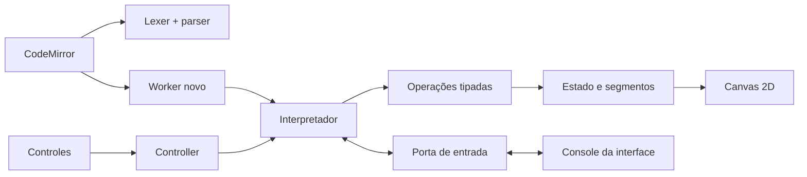

# Arquitetura e manutenção

## Dependências

`@logo/logo` não depende de nenhum pacote de navegador. Exporta lexer, parser, vocabulário, diagnósticos, interpretador, tipos de operações e portas de I/O. `@logo/turtle` usa apenas o tipo de operação; não tem DOM. `@logo/canvas-renderer` consome estado da tartaruga e Canvas 2D. `@logo/playground` integra os três pacotes via Vite. CodeMirror fornece editor, tokens, gutter de erros, histórico e realce de execução. A UI não precisa de framework de componentes para este escopo.

Os pacotes exportam TypeScript-fonte. `build` das bibliotecas verifica tipos; Vite produz o bundle do aplicativo e um bundle independente do Worker. Turborepo ordena tarefas e mantém cache local. Não há dados do usuário enviados a serviços.

## Pipeline

O parser coleta assinaturas e depois compila os corpos. Expressões têm aridade conhecida e operadores de precedência definida. Blocos executáveis são ASTs produzidas somente de listas escritas no código. Dados e código permanecem separados. O interpretador não consulta o canvas nem usa avaliação de JavaScript.

## Agendamento

`Controller.before(location)` concede permissões de instrução. Pausa não recria a VM; passos concedem créditos individuais. O atraso pode ser recalculado quando a velocidade muda. Checkpoints curtos cedem ao event loop para receber controle. O contador do interpretador é independente do relógio e do agendador.

Argumentos compartilham a permissão da instrução externa, inclusive procedimentos usados como reporters. O orçamento ainda conta trabalho interno. `afterInput` respeita pausa explícita e a permissão de passo que originou a leitura.

O protocolo em `protocol.ts` é uma união discriminada de mensagens TypeScript. Interface → Worker: start, pause, resume, step, stop, speed, input. Worker → interface: state, operation, write, input, input-error, error. Localizações acompanham estados, operações e diagnósticos. Em velocidade instantânea, atualizações de realce são amostradas a cada 32 instruções. Leituras são sequenciais com ID crescente. Eventos pertencem à instância ativa do Worker; Parar encerra essa instância e remove a espera.

A interface mantém o desenho; cancelar o Worker não apaga segmentos. Executar cria novo Worker, estado inicial e console novo. Nenhum temporizador de espera ou entrada sobrevive a essa substituição. Operações são aplicadas imediatamente e canvas e console são atualizados no máximo uma vez por quadro via `requestAnimationFrame`.

## Arquivos e edição

CodeMirror contém o texto de trabalho; há uma referência do último conteúdo salvo para detectar alterações. O conteúdo bruto de um arquivo aberto é preservado para download sem edição (incluindo CRLF/BOM); documentos modificados são serializados com LF. Leitura UTF-8 inválida é rejeitada. Abrir nunca grava no arquivo de origem. Novo/Abrir/exemplo pedem confirmação antes de substituir alterações. Durante a execução o editor e seletores de linguagem ficam bloqueados, mantendo correspondência entre offsets executados e o código exibido. Interface e aparência continuam ajustáveis.

## Testes e extensões

- Vitest usa portas de I/O simuladas, operações capturadas e temporizadores falsos do Controller.
- Playwright roda a interface e Workers reais, incluindo limite de orçamento, cancelamento e nova execução.
- O renderer possui testes de transformação/DPR/imutabilidade e snapshots PNG sem fontes, controlados por viewport, Chromium e DPR 1.
- Para adicionar comando, atualize vocabulário, interpretação, ajuda em ambos os idiomas, exemplo e caminhos de erro. `npm run docs` mantém a referência e arquivos `.logo` alinhados.
- Alterar semântica de passos exige validar testes do Controller e testes reais de entrada/pausa/step.

Não há processos de publicação, credenciais, repositórios remotos ou alteração de arquivos `sources/` neste projeto.
